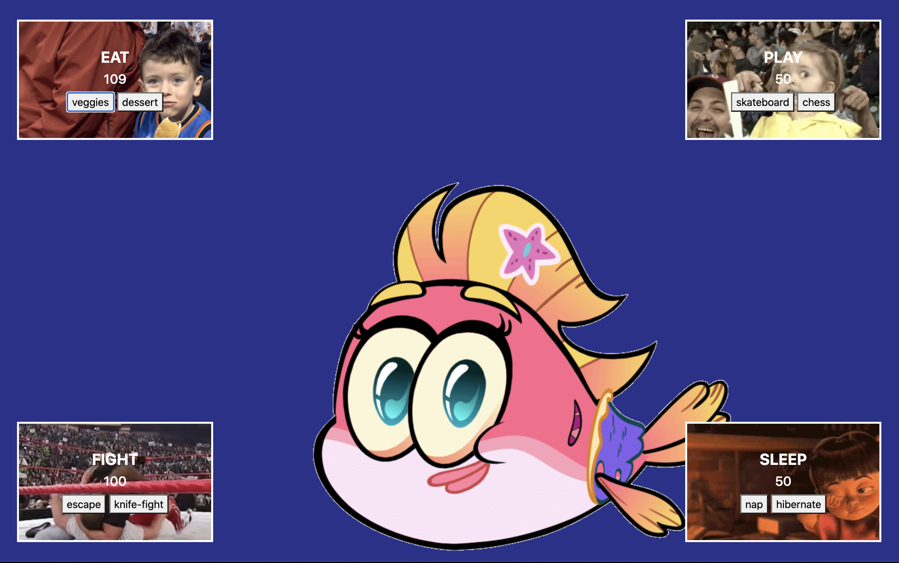

# Tamagotchi

The purpose of this project was to test some of the skills we had just learned with Sass and webpacks.

## Features

* The user can feed the tamagotchi healthy food or dessert and it will manipulate the health 
* The user can play either a fun activity or a boring one and it will manipulate the health 
* The user can fight in a knife fight or run away and it will manipulate the health 
* The user can sleep and hibernate or just nap and it will manipulate the health 

### Tech Used

* JQuery
* SASS
* Javascript
* Bootstrap
* HTML
* CSS

### Deployed here

https://jstamagotchi.netlify.app/

